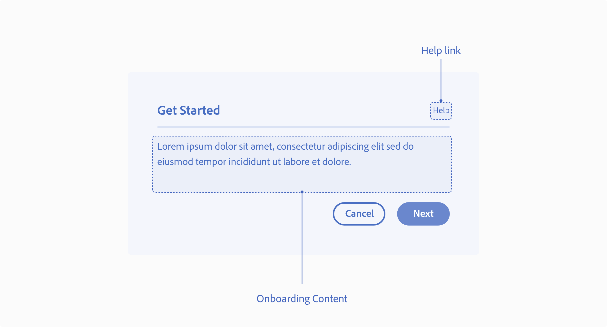

# Onboarding

These are guidelines and best practices on how to guide your users as they interact with your plugin. Providing users with examples on how to use the plugin can help your user get the most out of the plugin. This is helpful when the user is interacting with the plugin for the first time.

 

 
 
## Best practices

**Content**  
Provide examples or tutorials on how to use your plugin, this can be done by using visual or gifs.

**A. Plugin Interaction**  
Highlight key interactions to make sure users can get the plugin to work.

**B. Login experience**  
They need to log in or sign up for a service to use your plugin, guide them through the sign-up process.

**C. Authentication**  
If the plugin needs an API key or other account information, provide clear instructions on how they can get that information or provide a link.

**D. Help**  
Provide access to the help external link or documentation in the main navigation of your plugin or in error modal dialogs to allow them to troubleshoot.
