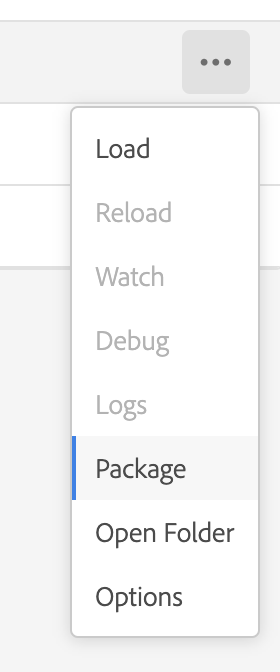
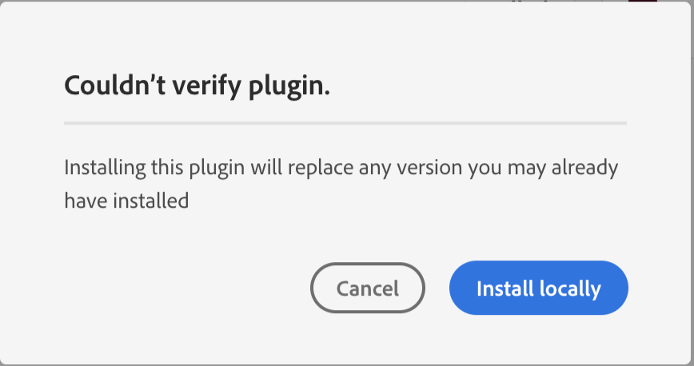

# Packaging Your Plugin

Taking your plugin code and packaging it has never been easier.

UXP plugins for Photoshop are distributed in the form of a `.ccx` file. Under the hood, this is a zip file. Unless you have some special requirements, you should not be creating this zip file yourself.

<InlineAlert variant="info" slots="text"/>

**IMPORTANT**:
Before you package your plugin for distribution outside your own computer, make sure you've obtained a valid ID from the [Adobe Developer Console](https://console.adobe.io). Without an id (which goes in the `id` field of your plugin's `manifest.json` file), you won't be able to distribute your plugin in the Creative Cloud Marketplace.

Using the [UXP Developer Tool](../guides/uxp-developer-tool), choose `Package` from the Actions menu (the ellipsis on the right side of the Developer Tool window, on the same line as your plugin name):

This shows a "Select target directory" dialog. Choose a directory where your built plugin `.ccx` file should reside.

After the `.ccx` file has been created, you should see this message at the bottom of the Developer Tool window:

If instead, you see this:

Click on `Details` to view a window that shows why the packaging failed.

Once your `.ccx` file has been built, you should test it locally before doing anything else. To install a .ccx file into any Creative Cloud application, double click it. This will open the Creative Cloud application, and you'll get a warning that your plugin hasn't been verified by Adobe:

Since you wrote the plugin, it's probably safe to install. Click `Install locally` and you'll see another warning:

Since, in this case, *you* are the third-party developer, it's safe to click OK. Obviously, if someone else sends you a `.ccx` file and you get this dialog, you should make sure you trust the person who sent it.

Now that you have your plugin installed, test it again to make sure the packaged version performs correctly. Then move on to [Options for Distribution](../distribution-options) to get your plugin out into the world.
