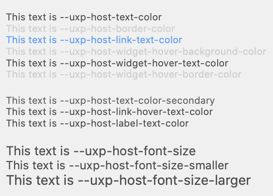

# Making Your Plugin Theme-aware

## Overview

Photoshop allows the user to switch the UI between four themes:


* Darkest
* Dark
* Light
* Lightest

If your plugin is not theme aware, it can look out of place (or possibly have unreadable text) when the user switches themes. It's very straightforward to add theme awareness to your plugin, so there's really no reason not to.

## Built-in Theme Colors

The easiest way to make your plugin theme-aware is to make use of a CSS feature called `CSS variables`. CSS variables are just what they sound like: a way to have dynamic property definitions in CSS.

Luckily, Photoshop exposes a number of theme-specific CSS variables that are perfect for making your plugin respond to the user's theme color choice. These variables are:

* --uxp-host-background-color
* --uxp-host-text-color
* --uxp-host-border-color
* --uxp-host-link-text-color
* --uxp-host-widget-hover-background-color
* --uxp-host-widget-hover-text-color
* --uxp-host-widget-hover-border-color

And a few more: 
* --uxp-host-text-color-secondary
* --uxp-host-link-hover-text-color
* --uxp-host-label-text-color
 
Finally, there are three dealing with font size:
* --uxp-host-font-size
* --uxp-host-font-size-smaller
* --uxp-host-font-size-larger

## How to Use CSS Variables

In the CSS for your plugin panel, use the built-in CSS variables like this:

```css
body {
    background-color: var(--uxp-host-background-color);
    color: var(--uxp-host-text-color);
    border-color: var(--uxp-host-border-color);
    font-size: var(--uxp-host-font-size);
}
```

Of course, you don't have to style the entire body of your panel with these variables; you could style individual CSS classes instead.

```css
.bigText {
    color: var(--uxp-host-text-color);
    font-size: var(--uxp-host-font-size-larger);
}
.smallText {
    color: var(--uxp-host-text-color);
    font-size: var(--uxp-host-font-size-smaller);
}
```

## How Do They Look?

If you create a simple HTML file that includes these CSS variables, here's how they'll look in Photoshop.

On the "darkest" theme, they look like this:


And on the "lightest" theme, they look like this:

